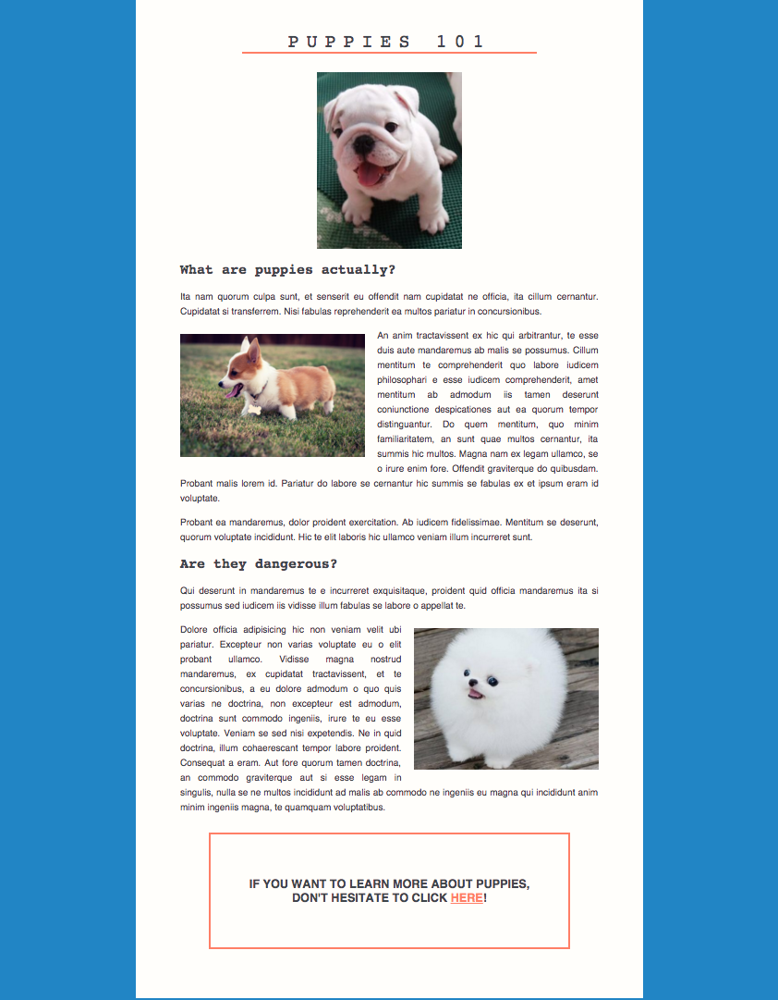

# Puppies 101

## Frontend Homework Assignment

### Tasks

#### 1. HTML

Create website structure with HTML. Use `src/index.html`.

#### 2. CSS

Implement styling.

#### 3. JavaScript

  * When the user clicks on the link 'HERE' at the bottom of the page, open a
    model dialog window in the middle of the screen with some puppy-related
    text.
  * Add a closing 'X' icon to the window's top-right corner. Clicking on the
    icon closes the window.
  * BONUS: Add an iframe to the window that shows the Wikipedia page for Puppy.

### Instructions

1. Fork the repository

    As a first step fork the puppies-101 repository. Please see the
    [docs](https://docs.github.com/en/get-started/quickstart/fork-a-repo) for more
    information.

2. Clone the repository from GitHub

        # Clone the repository
        $ git clone https://github.com/<your GitHub user>/puppies-101.git
        $ cd puppies-101/src

3. Install local web server

        # Install local-web-server
        $ npm install local-web-server -g

4. Run local web server

        # Run local-web-server
        $ ws

5. Visit website in the browser

    Open `localhost:8000` in your preferred browser.

6. Complete the task

### Submitting your work

1. Commit your changes to your local repository
2. Push changes to your fork
3. *DO NOT* open a pull request
4. Reply to our email with a link to your GitHub repository.
